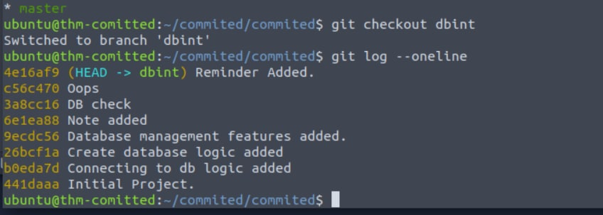

# TryHackMe - Committed

<b>Level</b>:EASY

<b>Link</b>:<a href="https://tryhackme.com/room/committed">https://tryhackme.com/room/committed</a>

   

## Part 1 - My inattention

Start machine and press "Split Terminal" to avoid my mistakes and time spend 

## Part 2 - Overview

Unzip repository

 

Let's check available branches & commits

 
 

### So the task is to go through the history and check the content to find the flag 

 

## Part 3 - Recon

Go through the commits and check <code>main.py</code> file to get the flag

 
 

## Part 4 - New branch

Then I've moved to <code>dbint</code> branch

 

Here on commit <code>3a8cc16</code> you'll find a version with hardcoded flag

 

Finally,get the flag

 