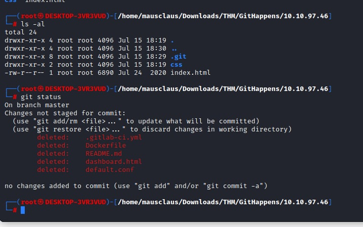
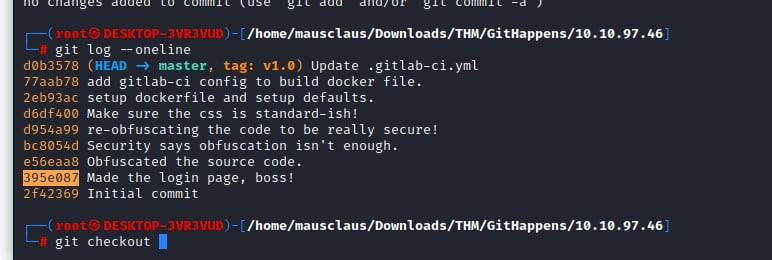
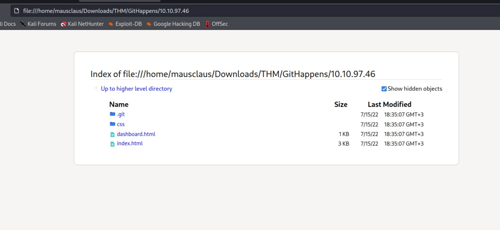
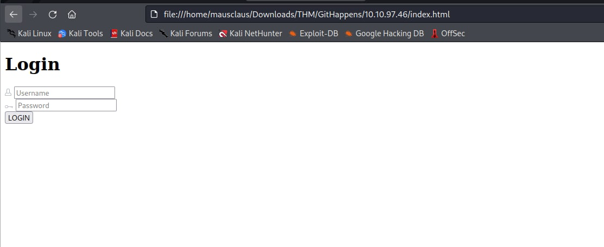
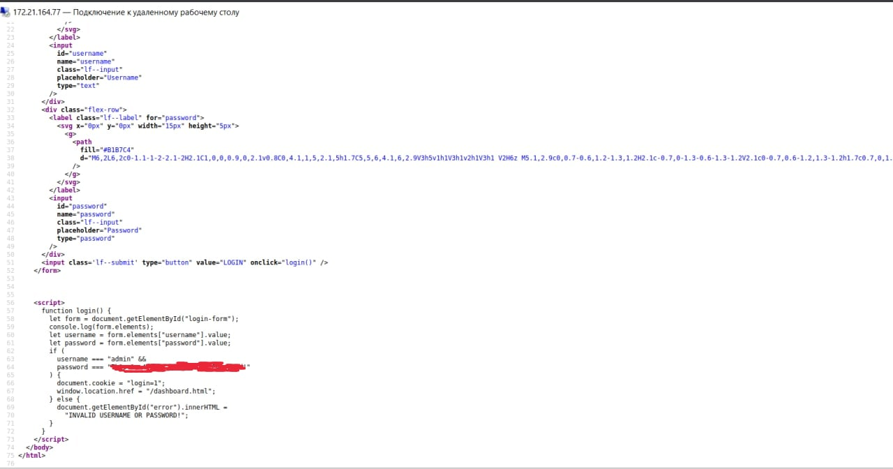

# TryHackMe - GitHappens

<div align="center">


</div>

<p><b>Level</b>:EASY</p>

<p><b>Link</b>:<a href="https://tryhackme.com/room/githappens">https://tryhackme.com/room/githappens</a></p>

<br/><br/><br/>

## Part 1 - Clone repository

Do it recursively via <code>wget</code>

```shell

wget -r http://10.10.97.46/.git/

```



<br/><br/>

## Part 2 - Go to right commit

This one looks interesting



<p>Go to <code>index.html</code></p>




<p>Check the source code</p>

