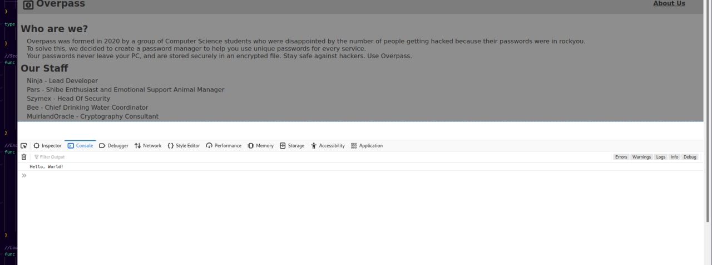
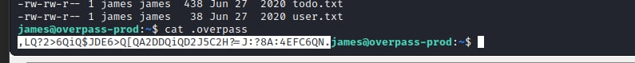

# <b>Overpass</b>

Level - easy

  

## <b>Step 1 - Initial overview</b>
 

Go to web server coz no sense to brute SSH(no clue about passwords & private keys or any other hints)

 

Here is simple site. Small number of any external links, directories, nothing in source code or console

 

  

## <b>Step 2 - Dirbusting</b>
 

Let's try to find directories

For this time - only <b>/admin</b> is interesting. Let's check

  

## <b>Step 3 - Research</b>
 

Let's discover the source code. Here we can notice <b>login.js</b> script which looks interesting because gives us informarion about auth logic.

 

 
Here we can see that the function save the cookie <b>SessionToken</b> if login was success. But hint said us about OWASP, so let's to exploit it via manual cookie change using dev console
 

 
We don't know the value,so use HelloWorld. Then,make a reload
 

## BOOOM we have someone's RSA encrypted private key for SSH

Name hints us that it's user <code>james</code>
 

  

## <b>Step 4 - What next?</b>

Honestly, I've stuck here for a while, because hint said us "not to brute", so I've no clue where to find the other hints. I've decided to run <code>John The Ripper</code> and continue to find something more.

After a few seconds I've received password...😅

  

## <b>Step 4 - On machine</b>

Firstly connect and grab <code>user.txt</code>

  

## <b>Step 5 - PrivEsc</b>

Before we start, I've initially downloaded <code>overpass.go</code> to check the source code. Here is simply ROT47, so we can easily encrypt the ciphertext

 

 

The only interesting file here is ~/.overpass with ciphertext of our passwords

Come back to our terminal with SSH session and find this file locally

 

 
Make sure it's james' password by test on <code>sudo</code>
 

  
I've notice that we have access to <code>nano</code>, so let's use <b>LinEnum</b> bash script to get quick enumeration

Among tons of useless data, found interesting point for crontab. Some bash script taken from <b>overpass.thm</b> will be runned as root.

<b>overpass.thm</b> doesn't look like real domain, so let's try to modify <code>/etc/hosts</code> and add our VPN's interface for this domain. Run a python oneliner for test

  

## Yeah, we have a query, so let's put a reverse shell here

 

Run a listener

And after a few seconds we have a shell

