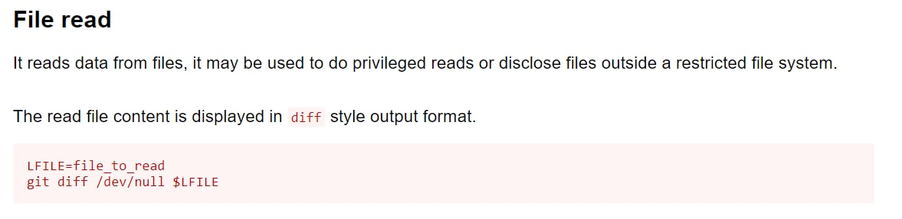
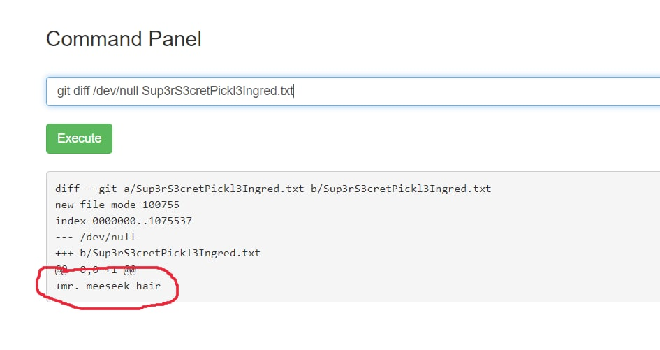
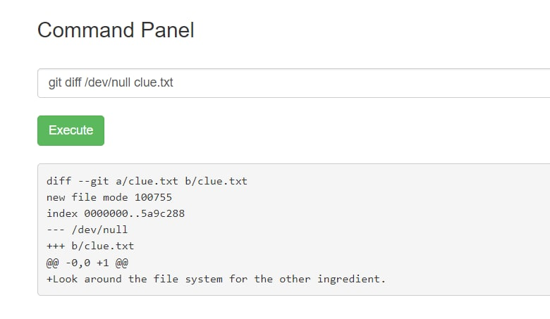
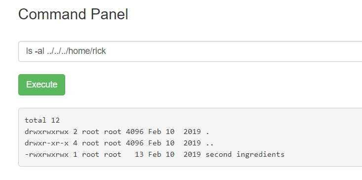
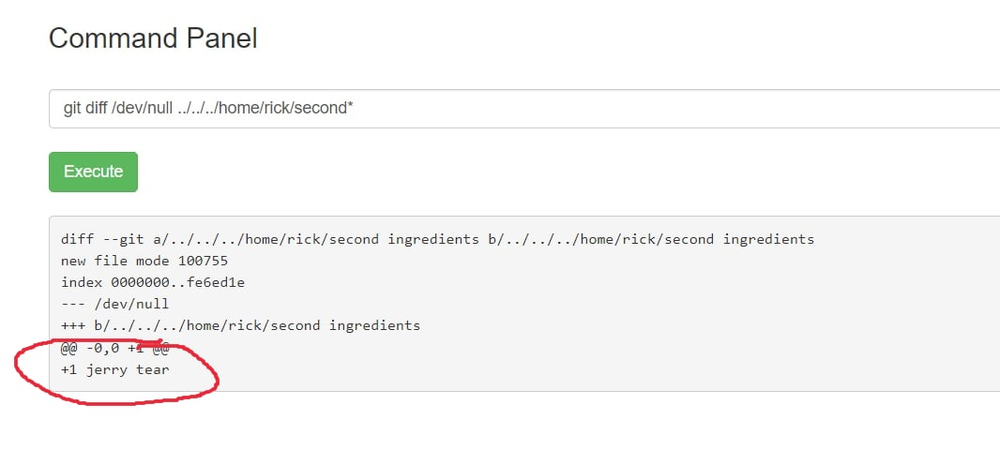
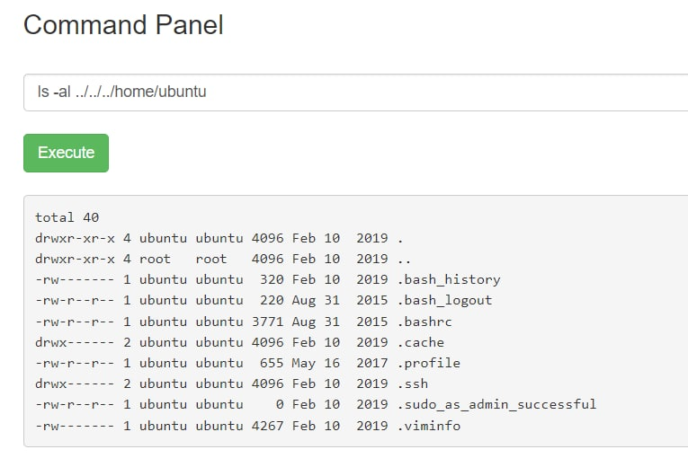
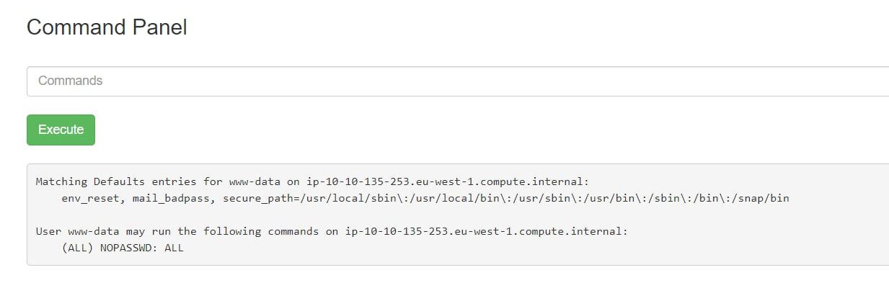
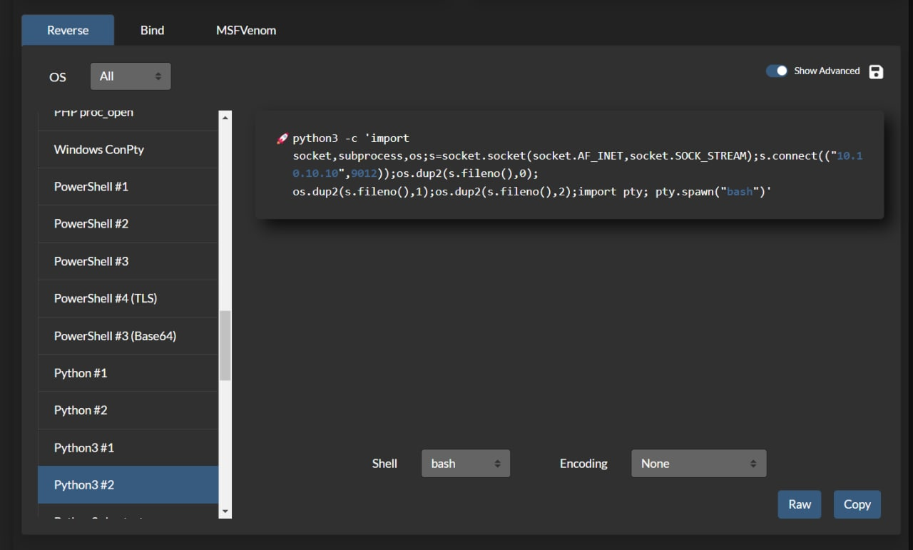

<div align="center">


</div>

# <b>Pickle Rick</b>

Simple room. In general - use directory traversal + reverse shell for the third flag

<br/><br/>

## <b>Step 1 - Initial overview</b>
<br/>


<br/>

Since nothing interesting(fields and so on) - check the source code, console , scripts | styles comments and other sources we have on this stage. Lucky for you, we can find something interesting immidiately in index sources

<br/>


Store it - it might be an SSH / FTP username or this site's login


<br/>

## <b>Step 2 - Port scan + Dirbusting</b>


<br/>
Then I've tried to scan the machine with <b>nmap</b> but in general - nothing interesting excluding potential SMB or some differences with content on 80 port

<br/>


<br/>
After this "micro-fail" let's try to find interesting locations via <b>dirsearch</b>...and we have the following results

<br/>


<br/>

## <b>Step 3 - Find creds & places to use them</b>

Go to <b>/robots.txt</b> and see


That's can be the "second part" for some credentials pair. We already have username, now something which looks like password. Now go to /login.php and try to use this pair.


<h1 align="center"><b>Awesome,move on</b></h1>

Try default shell commands to get the role, location and so on.After some attempts you'll notice some commands are blacklisted(you'll have an empty output). Ok,let's list the current directory


To get the content of files I've used bypass via GTFOBINS(popular bins which are usually on each machine by default). Follow link and choose <b>File read</b> option


<br/>

After some attempts I've found that we can read files via <b>git</b>. Use this pattern

```shell

git diff /dev/null 'FILE-TO-READ'

```



<br/>

## And we have the first flag




<br/>

## <b>Step 4 - Flag2</b>

Let's get some hint from <code>clue.txt</code>



Ok,let's do this. But not to spend your time, I'll give you a tip: Go to the <b>/home/rick</b>. Here we'll see the following



## And grab the second file




<br/>

## <b>Step 5 - Flag3</b>

You can also use flag <b>-a</b> to get the hidden dirs. For example



I've tried to read SSH keys, find secrets in .bash* files but nothing. We don't have rights. BTW,later I've noticed that we have so high privilleges(via <code>sudo -l</code>)



## <b>Let's use reverse shell</b>

Go to https://www.revshells.com/ and copy a shell for Python3



Run a listener locally and force connection. Then run <code>sudo bash</code> and you're <b>root</b> !!!. Now find the third flag in home directory
