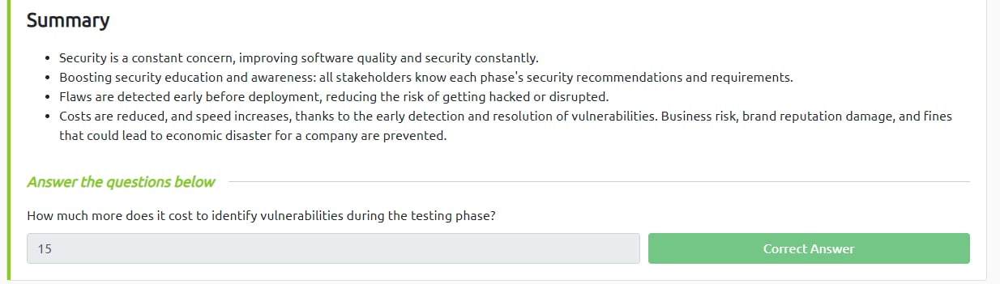
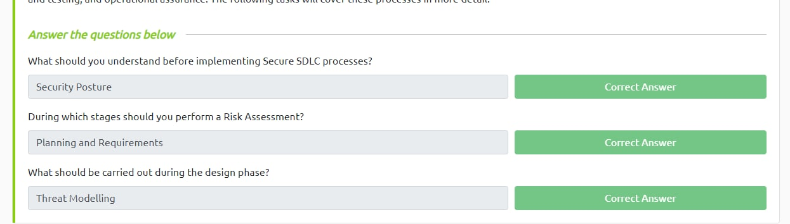
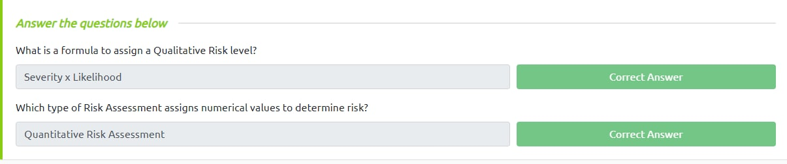
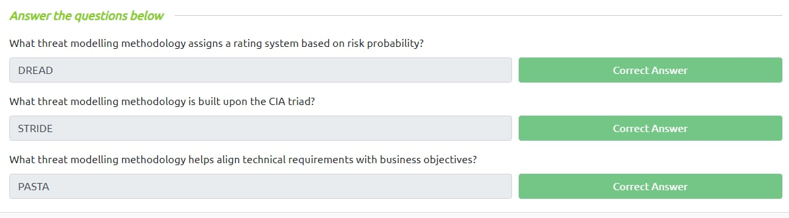
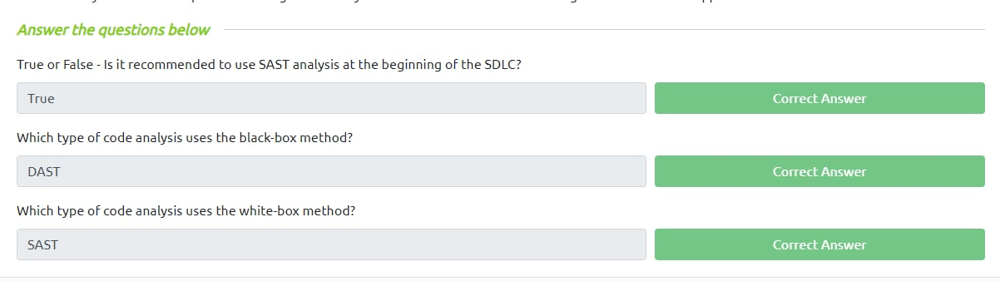
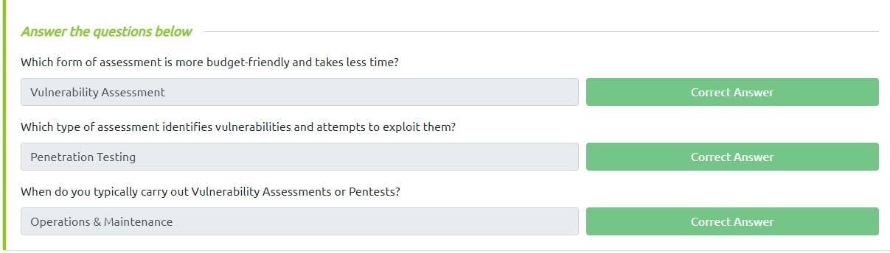
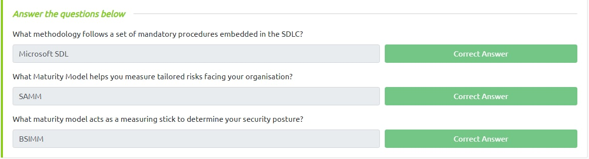
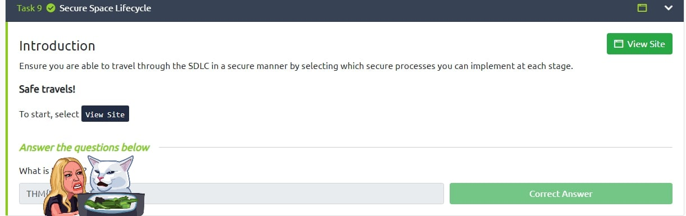

# THM - SSDLC

<b>Level</b>:EASY

<b>Link</b>:<a href="https://tryhackme.com/room/securesdlc">https://tryhackme.com/room/securesdlc</a>

   

## Part 1

## Part 2

## Part 3

## Part 4

## Part 5

## Part 6

## Part 7

## Part 8

<ul>
<li>RISK MANAGEMENT</li>
<li>THREAT MODELLING</li>
<li>SAST</li>
<li>DAST</li>
<li>Code Review</li>
<li>Secure Configs</li>
<li>*something in the middle*</li>
</ul>

